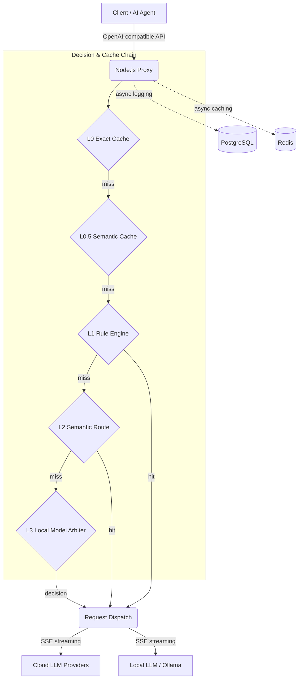

<div align="center">


# Smart Router Butler

**One interface, every model at your command. Your local AI routing butler.**

[](LICENSE)
[](https://github.com/Moonaria123/smart-router-butler/actions/workflows/ci.yml)
[](CODE_OF_CONDUCT.md)

[](https://www.typescriptlang.org/)
[](https://www.python.org/)
[](https://nextjs.org/)

[**Quick Start**](#-quick-start-self-hosted) · [**Features**](#-core-features) · [**Configuration**](#%EF%B8%8F-configuration-summary) · [**Security**](#%EF%B8%8F-security--privacy)

[English](README.md) | [中文](README.zh-CN.md)

*Smart Router Butler is a 100% self-hosted, OpenAI-compatible API smart router. It automatically balances cost, latency, and quality — connect to a single endpoint and seamlessly dispatch requests across cloud LLMs and local models.*

</div>

---

## Why Smart Router Butler?

When using AI agents and IDE-assisted coding daily, we constantly hit these pain points:

- **Steep API costs** — Whether it's a simple spell check or complex architecture design, tools default to the most expensive models (GPT-4o, Claude 3.5 Sonnet, etc.).
- **Rigid global config** — No way to assign the right model per task type (code completion, long-form summarization, multi-step reasoning).
- **Black-box fragility** — Routing logic is opaque; when a single model provider goes down, the entire agent workflow collapses.

**Smart Router Butler** turns "which model to use" into a **policy-driven, hot-reloadable** configuration problem. It acts as your local proxy layer, intercepts all LLM requests, and intelligently dispatches them based on your rules and semantic understanding.

---

## Core Features

- **Multi-layer intelligent routing** — Pioneering L1 (rules) + L2 (semantic) + L3 (local model arbitration) three-tier decision chain for precise task-to-model matching.
- **Significant cost reduction** — Offload simple tasks to local models or cheap APIs; reserve flagship models for complex tasks only.
- **High availability & auto-fallback** — Built-in circuit breaker and fallback chains. When the primary model times out or errors, traffic automatically shifts to backups.
- **Full observability** — Beautiful Next.js web dashboard with request logs, token usage, rule hit analysis at a glance.
- **100% data control** — Fully self-hosted, data never leaves your infrastructure. API keys encrypted with AES-256-GCM — no third-party gateway privacy risks.
- **Blazing performance** — L1 rule engine matches in-memory synchronously (<2ms). Full SSE streaming passthrough for zero-latency feel.

---

## Architecture & Routing Decision Chain



> **L3 Arbitration** relies on a small model running on the host via Ollama (e.g. `fauxpaslife/arch-router:1.5b`). When rules and semantics can't determine the best target, the AI dynamically decides. On timeout or unavailability, it gracefully degrades to the default model.

---

## UI Preview

<div align="center">

| Routing Rules | Natural Language Rule Generator |
|:---:|:---:|
|  |  |

| Rule Hit Analysis | Rule Editor |
|:---:|:---:|
|  |  |

| AI Rule Wizard | Request Logs |
|:---:|:---:|
|  |  |

| Raw JSON Editor |
|:---:|
|  |

</div>

---

## Quick Start (Self-Hosted)

### Prerequisites

| Dependency | Description |
|---|---|
| **Docker & Compose** | One-command orchestration of `proxy` / `router` / `dashboard` / `postgres` / `redis` |
| **Ollama** (optional) | For L3 local model arbitration; containers access the host via `host.docker.internal:11434` |

**Source distribution**: Currently distributed **via GitHub only** (`git clone`, **Code → Download ZIP**, or **Releases**). `npm install` is only used to install third-party dependencies inside `proxy/` and `dashboard/` after cloning.

### Deploy in 3 Minutes

1. **Clone**

   ```bash
   git clone https://github.com/Moonaria123/smart-router-butler.git
   cd smart-router-butler
   ```

2. **Environment variables**

   ```bash
   cp .env.example .env
   # Edit: DATABASE_URL, REDIS_URL, ENCRYPTION_KEY, BETTER_AUTH_SECRET, etc.
   ```

3. **(Optional) Pull L3 model**

   ```bash
   ollama pull fauxpaslife/arch-router:1.5b
   ```

4. **Launch**

   ```bash
   docker compose up -d
   docker compose exec dashboard npx prisma migrate deploy
   ```

5. **Access**: Dashboard at `http://localhost:3000`; point your client to the proxy's OpenAI-compatible endpoint at `http://localhost:8080/v1`.

See `docker-compose.yml`, `docker-compose.release.yml`, and sub-directory READMEs for details.

### npm Dependencies for Local Development

When running `npm ci` in `proxy/` or `dashboard/`, the `.npmrc` file only affects the **dependency package** download source — it does **not** replace `git clone`. Dockerfiles copy `.npmrc` automatically. The router uses `pip install -r requirements.txt`.

---

## Configuration Summary

| Category | Entry Point |
|---|---|
| Global & ports | `.env.example`, `compose/ports.env` |
| Proxy / routing | `PYTHON_ROUTER_URL`, `OLLAMA_URL`, `ARCH_ROUTER_MODEL`, `ROUTING_ENABLE_L2` / `L3`, etc. |
| Dashboard & auth | `BETTER_AUTH_URL`, `BETTER_AUTH_SECRET`, `DATABASE_URL`, `PROXY_URL` |
| Pre-built images | `GHCR_OWNER`, `SMARTROUTER_IMAGE_TAG` |

**Never** commit `.env`, API keys, or production connection strings to Git.

---

## Comparison with Alternatives

| Dimension | Typical Cloud API Gateway | Smart Router Butler |
|---|---|---|
| **Data privacy** | Traffic routed through third parties — leak risk | **100% self-hosted**, data stays on your infrastructure |
| **Routing logic** | Platform black-box, no user control | **L1/L2/L3 white-box**, transparent, configurable, explainable |
| **Compliance** | Dependent on vendor terms, region-locked | **Deploy on your own network**, meets the strictest enterprise requirements |
| **Cost control** | Platform fees or fixed monthly charges | **Zero platform fees**, route on-demand to maximize free/cheap model value |

---

## Repository Structure

| Directory | Description |
|---|---|
| `proxy/` | Node.js proxy: OpenAI-compatible API, L0/L1 cache & rules, SSE |
| `router/` | FastAPI: semantic routing, caching, L3 integration |
| `dashboard/` | Next.js: rules, providers, logs, settings |
| `contracts/` | Inter-service contracts |

---

## Development & Health Checks (Maintainers)

```bash
# proxy/
npm run type-check && npm run lint

# router/
python -m mypy app/ --strict && python -m ruff check app/

# dashboard/
npm run type-check && npm run lint
```

---

## Open-Source Governance

| Document | Description |
|---|---|
| [**LICENSE**](LICENSE) | **MIT** License |
| [**CODE_OF_CONDUCT.md**](CODE_OF_CONDUCT.md) | Community standards based on **Contributor Covenant 2.1** |
| [**CONTRIBUTING.md**](CONTRIBUTING.md) | Contribution workflow, IP policy, and coding standards |
| [**SECURITY.md**](SECURITY.md) | Vulnerability reporting & responsible disclosure |

Please read the **Code of Conduct** before participating in Issues, PRs, or Discussions. Maintainers reserve the right to moderate disruptive or harassing content.

---

## Security & Privacy

- **Vulnerability reports**: Do not disclose exploitable details publicly. Follow [**SECURITY.md**](SECURITY.md).
- **Deployment & data**: This software is **self-hosted**. User prompts, responses, logs, and keys are managed **by the deployer** on their own infrastructure. **You are responsible** for reviewing upstream LLM provider terms of service and data residency policies.
- **Supply chain**: We recommend locking image and dependency versions (`package-lock.json`, `requirements.txt`) in production and monitoring security advisories.

---

## Contributing

Issues and Pull Requests are welcome — see [**CONTRIBUTING.md**](CONTRIBUTING.md). By contributing, you agree to the [**CODE_OF_CONDUCT.md**](CODE_OF_CONDUCT.md) and the licensing terms in [**LICENSE**](LICENSE).

---

## License & Disclaimer

- Released under the [**MIT License**](LICENSE).
- **Provided "AS IS"**: No warranties of merchantability, fitness for a particular purpose, or non-infringement — **use at your own risk**.
- **Limitation of liability**: To the extent permitted by law, authors and contributors shall not be liable for any indirect, incidental, special, or consequential damages.

---

## Further Reading

- For discussions on intelligent routing and cost optimization, see similar projects in the community. This repository makes no claims of feature parity with third-party products.
