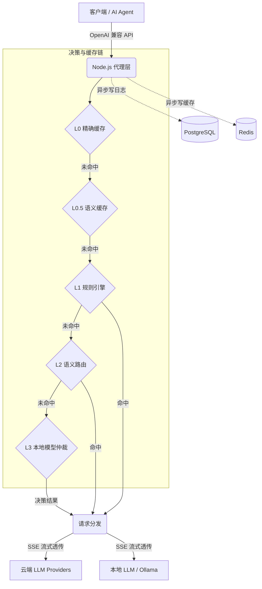

<div align="center">


#  Smart Routing Butler

**一个接口，万模随心。你的本地 AI 智能路由管家。**

[](LICENSE)
[](https://github.com/Moonaria123/Smart-Routing-Butler-for-OpenClaws/actions/workflows/ci.yml)
[](CODE_OF_CONDUCT.md)
[](https://github.com/Moonaria123/Smart-Routing-Butler-for-OpenClaws/stargazers)

[](https://www.typescriptlang.org/)
[](https://www.python.org/)
[](https://nextjs.org/)
[](https://github.com/Moonaria123/Smart-Routing-Butler-for-OpenClaws/commits)
[](https://github.com/Moonaria123/Smart-Routing-Butler-for-OpenClaws/issues)
[](CONTRIBUTING.md)

[**快速开始**](#-快速开始自托管) · [**核心特性**](#-核心特性) · [**配置指南**](#%EF%B8%8F-配置说明摘要) · [**安全与隐私**](#%EF%B8%8F-安全与隐私)

[English](README.md) | [中文](README.zh-CN.md)

*Smart Routing Butler 是一套 100% 本地运行、可自托管的 OpenAI 兼容 API 智能路由器，专为 AI Agent（OpenClaw、Cursor、Continue 等）和开发者工具设计。它在成本、延迟与质量之间自动权衡，让你只需对接一个端点，即可无缝调度云端大模型与本地小模型。*

</div>

---

<details>
<summary><strong>📑 目录</strong></summary>

- [💡 为什么需要 Smart Routing Butler？](#-为什么需要-smart-routing-butler)
- [🔀 与其它方案的差异](#-与其它方案的差异)
- [✨ 核心特性](#-核心特性)
- [📸 界面预览](#-界面预览)
- [🎯 规则创建 — 三种方式](#-规则创建--三种方式构建你的路由策略)
- [🔌 OpenAI 兼容本地代理](#-openai-兼容本地代理)
- [🔍 路由层级详解](#-路由层级详解)
- [🏗️ 架构概览](#%EF%B8%8F-架构概览)
- [🚀 快速开始（自托管）](#-快速开始自托管)
- [⚙️ 配置说明（摘要）](#%EF%B8%8F-配置说明摘要)
- [📂 仓库结构](#-仓库结构节选)
- [🛠️ 开发与健康检查](#%EF%B8%8F-开发与健康检查维护者)
- [🗺️ 路线图](#%EF%B8%8F-路线图)
- [⚖️ 开源治理与合规](#%EF%B8%8F-开源治理与合规)
- [🛡️ 安全与隐私](#%EF%B8%8F-安全与隐私)
- [🤝 贡献](#-贡献)
- [📜 许可证与免责声明](#-许可证与免责声明)
- [🙏 致谢](#-致谢)

</details>

---

## 💡 为什么需要 Smart Routing Butler？

在使用 AI Agent（OpenClaw、Cursor、Continue 等）和 IDE 辅助编程的日常工作中，我们经常遇到这些痛点：

- 💸 **高昂的 API 成本**：无论是简单的拼写检查还是复杂的架构设计，工具往往无法随意切换到价格合适的模型。
- 🧱 **死板的全局配置**：无法根据任务类型（代码补全、长文总结、多步推理）灵活分配最合适的模型。
- 📦 **黑盒与脆弱性**：路由逻辑不透明，单一模型服务不可用时，整个代理工作流直接崩溃。

**Smart Routing Butler** 将「选哪个模型」变成了一个**可策略化、可热更新**的配置问题。它作为你的本地代理层，接管所有 LLM 请求，并根据你设定的规则和语义智能分发。

<p align="right"><a href="#-smart-routing-butler">⬆ 回到顶部</a></p>

## 🔀 与其它方案的差异

| 维度 | 典型云端聚合网关 | Smart Routing Butler |
|------|------------------|---------------------|
| **接入方式** | 需要安装专用插件、浏览器扩展或 SDK 封装 | **标准 OpenAI 兼容端点** — 填入本地 URL + API Key 即可使用，无需任何插件 |
| **数据隐私** | 流量经第三方中转，存在泄露风险 | **100% 自托管**，数据在本地网络内转发 |
| **路由逻辑** | 平台黑盒，无法干预 | **L0–L3 白盒化**，规则透明、可配置、可解释 |
| **规则自定义** | 有限或不支持用户自定义规则 | 可视化编辑器 + 自然语言 + AI 向导，三种方式创建自定义路由规则 |
| **合规性** | 依赖供应商条款，受限于地域 | **可部署在自有网络**，满足最严格的企业合规要求 |
| **成本控制** | 平台抽成或固定月费 | **零平台费**，按需路由最大化榨干免费/廉价模型价值 |

<p align="right"><a href="#-smart-routing-butler">⬆ 回到顶部</a></p>

## ✨ 核心特性

- 🔌 **OpenAI 兼容本地代理，开箱即用** — 在本地网络暴露标准 `POST /v1/chat/completions` 和 `GET /v1/models` 端点。任何支持 OpenAI API 的工具（OpenClaw、Cursor、Continue、ChatBox 等）只需填入本地 URL 和 API Token 即可接入，**无需安装任何插件、浏览器扩展或修改 SDK**。所有流量在本地网络内转发，不经过任何外部网关。详见 [OpenAI 兼容本地代理](#-openai-兼容本地代理)。
- 🧠 **五层智能路由** — L0（精确缓存）+ L0.5（语义缓存）+ L1（用户自定义规则）+ L2（语义匹配）+ L3（本地模型仲裁）五层决策链，精准匹配任务与模型。详见[路由层级详解](#-路由层级详解)。
- 🎯 **灵活的规则创建** — 通过可视化编辑器自定义 L1 层路由规则，或让 AI 帮你：用自然语言描述需求自动生成规则，或使用 AI 问卷向导一键生成完整规则集。详见[规则创建 — 三种方式](#-规则创建--三种方式构建你的路由策略)。
- 💰 **显著降低成本** — 将简单任务卸载给本地模型或廉价 API，复杂任务保留给旗舰模型。
- 🛡️ **高可用与自动降级** — 内置熔断器与 Fallback 机制，主模型超时或报错时自动切换备用模型，保障业务不中断。
- 📊 **全链路可观测** — 提供精美的 Next.js Web 控制台，请求日志、Token 消耗、命中规则一目了然。
- 🔒 **100% 数据掌控** — 完全自托管，数据不下车；API Key 采用 AES-256-GCM 加密存储，拒绝第三方网关的隐私风险。
- ⚡ **极致性能** — L1 规则引擎内存同步匹配（<2ms），全程支持 SSE 流式透传，无感接入。

<p align="right"><a href="#-smart-routing-butler">⬆ 回到顶部</a></p>

## 📸 界面预览

点击分类展开浏览截图。

<details>
<summary><b>📊 控制台总览</b></summary>
<br>
<div align="center">

</div>
</details>

<details>
<summary><b>🔧 Provider 与模型管理</b></summary>
<br>
<div align="center">

<br><br>

<br><br>

</div>
</details>

<details>
<summary><b>📋 路由规则</b></summary>
<br>
<div align="center">

<br><br>

<br><br>

<br><br>

</div>
</details>

<details>
<summary><b>🤖 AI 规则生成</b></summary>
<br>
<div align="center">

<br><br>

<br><br>

<br><br>

</div>
</details>

<details>
<summary><b>📜 请求日志</b></summary>
<br>
<div align="center">

</div>
</details>

<details>
<summary><b>🔑 本地代理地址与 AI Agent 专用 API Key</b></summary>
<br>
<div align="center">

</div>
</details>

<details>
<summary><b>⚙️ 系统设置</b></summary>
<br>
<div align="center">

<br><br>

</div>
</details>

<p align="right"><a href="#-smart-routing-butler">⬆ 回到顶部</a></p>

## 🎯 规则创建 — 三种方式构建你的路由策略

Smart Routing Butler 提供三种创建路由规则的方式，从完全手动到完全 AI 驱动，可根据你的偏好自由选择和混合使用。

### 1. 自定义规则编辑器

通过 Web 控制台可视化创建规则，无需编写代码。支持按任务类型、关键词、Token 数量、模型偏好等多种条件组合；可设置优先级、目标模型及最多 3 个 Fallback 备选模型。规则保存后通过热更新立即生效。

<div align="center">

</div>

**示例 — 将编码任务路由到代码专用模型：**

| 字段 | 值 |
|---|---|
| 规则名称 | 代码编写规则 |
| 优先级 | 900（高） |
| 条件 | 任务类型 = `coding` |
| 目标模型 | `Alibaba/qwen3-coder-plus` |
| Fallback | `Alibaba/qwen3.5-plus` |

保存后，所有被识别为编码任务的请求会自动发送到代码优化模型；若主模型不可用，则自动切换到通用备选模型。

### 2. 自然语言规则生成器

用自然语言描述你的路由需求，内置 LLM 自动将其翻译为结构化规则。适合知道自己想要什么、但不想逐一配置字段的用户。

<div align="center">

</div>

**示例提示词：**

- `代码用 DeepSeek Coder，聊天用 GPT-4o-mini`
- `预算低于每百万 Token 5 美元时使用便宜模型`
- `如果 OpenAI 不健康，切换到 Anthropic`
- `长文档（>10000 Token）用 Claude，短问题用 GPT-4o-mini`
- `GPT-4o 处理数学/分析，DeepSeek 处理翻译`

输入一句话，点击 **生成规则**，系统自动生成一条或多条可用规则，你可以审阅、编辑并一键启用。

### 3. AI 问卷向导

5 步交互式向导，引导你选择使用场景、首选供应商、预算偏好和优先级，然后自动生成一套完整的初始规则集。

<div align="center">

</div>

**向导步骤：**

1. **选择使用场景** — 编码与调试、数据分析、内容创作、日常聊天、翻译、数学与推理、长文档处理
2. **选择供应商** — 从已配置的 Provider 中选取（OpenAI、Anthropic、阿里云、本地 Ollama 等）
3. **设定预算偏好** — 成本优先、均衡、质量优先
4. **定义优先级** — 延迟 vs. 质量 vs. 成本的权衡
5. **预览并应用** — 查看所有生成的规则，按需调整后一键激活

非常适合首次部署 — 从零规则到完整可运行的路由策略，不到 2 分钟。

<p align="right"><a href="#-smart-routing-butler">⬆ 回到顶部</a></p>

## 🔌 OpenAI 兼容本地代理

Smart Routing Butler 专为 **OpenClaw**、**Cursor**、**Continue**、**ChatBox** 等 AI Agent 和开发者工具设计。接入方式：**零插件、零 SDK 修改** — 填入本地 URL 和 Token 即可使用。

### 工作原理

代理层（Node.js，默认端口 `8080`）在本地网络暴露两个标准 OpenAI 兼容端点：

| 端点 | 方法 | 说明 |
|---|---|---|
| `/v1/chat/completions` | `POST` | 聊天补全（支持流式和非流式） |
| `/v1/models` | `GET` | 列出所有可用模型（含用于智能路由的 `auto` 虚拟模型） |

**客户端配置（任何 OpenAI 兼容工具）：**

```
Base URL:  http://localhost:8080/v1
API Key:   <在控制台「API Tokens」页面创建的 Token>
Model:     auto          （由路由器智能决策）
           — 或 —
           Provider/model （如 openai/gpt-4o，跳过路由直连）
```

### 底层流程

1. Agent 发送标准 `POST /v1/chat/completions` 请求，携带 `Authorization: Bearer <token>`。
2. 代理层验证 Token（SHA-256 哈希匹配 PostgreSQL，Redis 缓存 60 秒）。
3. 若 `model` = `auto`，请求进入[五层路由决策链](#-路由层级详解)；若指定了具体模型，则直连该 Provider。
4. 代理层解析目标 Provider，解密存储的 API Key（AES-256-GCM），将请求转发至上游 Provider API。
5. 流式请求（`stream: true`）时，SSE 数据块实时透传（`for await … res.write(chunk)`）— 零缓冲、零额外延迟。
6. 非流式响应中，代理层将 `model` 字段重写为实际目标模型并缓存结果。

**所有流量在本地转发**：`Agent → localhost:8080 → 上游 Provider API`。代理运行在你的机器或 Docker 主机上，请求不经过任何第三方网关或外部中转节点。

<p align="right"><a href="#-smart-routing-butler">⬆ 回到顶部</a></p>

## 🔍 路由层级详解

当 `model` 设为 `auto` 时，请求依次经过五个决策层。第一个命中的层级立即返回结果，未命中则传递到下一层。完整流程图参见[架构概览](#%EF%B8%8F-架构概览)。

### L0 — 精确缓存

- **Key**：`exact:<SHA256(model + messages_json)>`
- **存储**：Redis `GET` / `SET EX`，默认 TTL 24 小时。
- **速度**：亚毫秒级 Redis 查询。
- **触发条件**：完全相同的请求（相同模型 + 相同消息）且缓存未过期。

### L0.5 — 语义缓存

- **机制**：将用户消息嵌入为 384 维向量（`BAAI/bge-small-zh-v1.5`），通过 RediSearch 执行 KNN-1 余弦相似度查询。
- **阈值**：余弦相似度 >= **0.95**（可配置）。措辞略有不同但语义近似的问题也能命中缓存。
- **超时**：代理到路由器 55ms HTTP 预算；超时则跳过本层。

### L1 — 用户自定义规则引擎

这是**你的自定义路由规则**生效的层级。规则在启动时加载到内存，通过 Redis Pub/Sub 热更新 — 匹配完全同步，**P99 延迟 < 2ms**。

**支持的条件类型（可通过 AND / OR 组合）：**

| 条件 | 说明 |
|---|---|
| `taskType` | 自动检测的任务类别（coding、translation、analysis、math、creative、chat、summarization、general） |
| `keywords` | 对最后一条用户消息进行大小写不敏感的子串匹配 |
| `tokenCount` | 预估 Token 数在指定的最小/最大范围内 |
| `maxCost` | 每百万 Token 输入成本 <= 阈值 |
| `maxLatency` | Provider 平均延迟 <= 阈值 |
| `providerHealth` | Provider 健康状态匹配 |

规则按**优先级降序**（0–1000）逐条评估，第一个命中的规则返回其 `targetModel` 及最多 3 个 Fallback 备选模型。你可以通过可视化编辑器、自然语言生成器或 AI 向导创建规则（参见上方[规则创建](#-规则创建--三种方式构建你的路由策略)章节）。

### L2 — 语义路由

- **机制**：将最后一条用户消息嵌入后，与预配置的路由语料嵌入（8 个语义类别，如 "code"、"translation"、"math"）计算余弦相似度，最高分超过 **0.85** 阈值则命中。
- **超时**：55ms；未命中或超时则传递至 L3。
- **模型映射**：每个语义类别通过 `ROUTE_MODEL_MAP` 映射到 `provider/model`。

### L3 — 本地模型仲裁（Arch-Router）

- **机制**：将用户消息发送到宿主机上运行的 Ollama 本地小模型（默认：`fauxpaslife/arch-router:1.5b`，约 900MB）。模型返回 JSON 分类 `{"category": "...", "confidence": ...}`，映射到目标模型。
- **超时**：140ms 读取预算；超时、错误或无法识别的类别 → 降级到默认模型。
- **无外部调用**：Ollama 运行在你的宿主机上，路由器通过 `host.docker.internal:11434` 访问。

### 兜底策略

若所有层级均未命中，系统从数据库中选取**第一个启用的模型**作为默认目标，并异步递增 `L3_FALLBACK` 计数器以便在控制台中监控。

<p align="right"><a href="#-smart-routing-butler">⬆ 回到顶部</a></p>

## 🏗️ 架构概览

<div align="center">

</div>

<details>
<summary>Mermaid 源码（桌面端 GitHub 可交互渲染）</summary>



</details>

<p align="right"><a href="#-smart-routing-butler">⬆ 回到顶部</a></p>

## 🚀 快速开始（自托管）

### 前置条件

| 依赖 | 说明 |
|------|------|
| **Docker & Compose** | 用于一键编排 `proxy` / `router` / `dashboard` / `postgres` / `redis` |
| **Ollama**（可选） | 用于 L3 本地模型仲裁；容器内通过 `host.docker.internal:11434` 访问宿主机 |

**源码获取**：当前**仅通过 GitHub** 分发（`git clone`、**Code → Download ZIP** 或 **Releases** 资产）。**不提供** `npm install <包名>` 安装本系统；npm 仅用于克隆后在 `proxy/`、`dashboard/` 内安装**第三方依赖**。

### 3 分钟部署步骤

1. **克隆**

   ```bash
   git clone https://github.com/Moonaria123/Smart-Routing-Butler-for-OpenClaws.git
   cd Smart-Routing-Butler-for-OpenClaws
   ```

2. **环境变量**

   ```bash
   cp .env.example .env
   # 编辑：DATABASE_URL、REDIS_URL、ENCRYPTION_KEY、BETTER_AUTH_SECRET 等
   ```

3. **（可选）L3 模型**

   ```bash
   ollama pull fauxpaslife/arch-router:1.5b
   ```

4. **启动**

   ```bash
   docker compose up -d
   docker compose exec dashboard npx prisma migrate deploy
   ```

5. **访问**：控制台 `http://localhost:3000`；客户端指向 Proxy 的 OpenAI 兼容地址 `http://localhost:8080/v1`。

详见 `docker-compose.yml`、`docker-compose.release.yml` 与子目录 README。

### 本地开发时的 npm 依赖

在 `proxy/`、`dashboard/` 执行 `npm ci` 时，`.npmrc` 仅影响**依赖包**下载源，**不能**替代 `git clone`。Dockerfile 会复制 `.npmrc`；Router 使用 `pip install -r requirements.txt`。

<p align="right"><a href="#-smart-routing-butler">⬆ 回到顶部</a></p>

## ⚙️ 配置说明（摘要）

| 类别 | 入口 |
|------|------|
| 全局与端口 | `.env.example`、`compose/ports.env` |
| 代理 / 路由 | `PYTHON_ROUTER_URL`、`OLLAMA_URL`、`ARCH_ROUTER_MODEL`、`ROUTING_ENABLE_L2` / `L3` 等 |
| 控制台与认证 | `BETTER_AUTH_URL`、`BETTER_AUTH_SECRET`、`DATABASE_URL`、`PROXY_URL` |
| 预构建镜像 | `GHCR_OWNER`、`SMARTROUTER_IMAGE_TAG` |

**切勿**将 `.env`、API Key 或生产连接串提交到 Git。

<p align="right"><a href="#-smart-routing-butler">⬆ 回到顶部</a></p>

## 📂 仓库结构（节选）

| 目录 | 说明 |
|------|------|
| `proxy/` | Node.js 代理：OpenAI 兼容 API、L0/L1、SSE |
| `router/` | FastAPI：语义路由、缓存、L3 相关 |
| `dashboard/` | Next.js：规则、Provider、日志 |
| `contracts/` | 服务间契约 |

<p align="right"><a href="#-smart-routing-butler">⬆ 回到顶部</a></p>

## 🛠️ 开发与健康检查（维护者）

```bash
# proxy/
npm run type-check && npm run lint

# router/
python -m mypy app/ --strict && python -m ruff check app/

# dashboard/
npm run type-check && npm run lint
```

<p align="right"><a href="#-smart-routing-butler">⬆ 回到顶部</a></p>

## 🗺️ 路线图

**近期已交付 — `20260405`**

- **多模态与生成类流量**：`request_logs` 记录模态信息、总览 KPI；Proxy 增加图像生成等路由与多模态转发辅助（`proxy/src/routes/imageGenerations.ts`、`proxy/src/utils/multimodal.ts` 等）。
- **API Token（本地 Key）维度**：日志与导出中的 `apiTokenName`、规则命中与统计按 Token 筛选与聚合。
- **控制台总览分析**：独立统计 API（`/api/stats/overview-analytics`）及趋势图、饼图与筛选组件（`dashboard/src/components/overview/`）。
- **思考 / 推理模式**：模型能力位、规则 `thinkingStrategy`、请求日志字段；OpenAI `reasoning_effort` 映射。
- **安全**：Proxy Redis 滑动窗口限流（[SEC-003](https://github.com/Moonaria123/Smart-Routing-Butler-for-OpenClaws/issues/20)）；dashboard/proxy 通过 `overrides` 处理 npm audit 传递依赖（[SEC-002](https://github.com/Moonaria123/Smart-Routing-Butler-for-OpenClaws/issues/21)）。

**后续规划（待办）**

- [ ] 自定义路由策略插件系统
- [ ] 多用户团队协作与角色权限管理
- [ ] Token 预算跟踪与用量告警
- [ ] 更多 LLM 供应商接入（Google Gemini、Mistral 等）
- [ ] API Key 轮换与生命周期管理
- [ ] Prometheus / Grafana 指标导出

> 有功能建议？欢迎 [提交 Issue](https://github.com/Moonaria123/Smart-Routing-Butler-for-OpenClaws/issues) 描述你的使用场景。

<p align="right"><a href="#-smart-routing-butler">⬆ 回到顶部</a></p>

## ⚖️ 开源治理与合规

| 文档 | 说明 |
|------|------|
| [**LICENSE**](LICENSE) | **MIT** 授权 |
| [**CODE_OF_CONDUCT.md**](CODE_OF_CONDUCT.md) | 基于 **Contributor Covenant 2.1** 的社区行为准则 |
| [**CONTRIBUTING.md**](CONTRIBUTING.md) | 贡献流程、知识产权与代码规范 |
| [**SECURITY.md**](SECURITY.md) | 漏洞报告与负责任披露 |

参与 Issue、PR、讨论前请阅读 **行为准则**。维护者保留对破坏性、骚扰性内容采取管理措施的权利。

<p align="right"><a href="#-smart-routing-butler">⬆ 回到顶部</a></p>

## 🛡️ 安全与隐私

- **漏洞报告**：请勿在公开区披露可利用细节；请遵循 [**SECURITY.md**](SECURITY.md)。  
- **部署与数据**：本软件**自托管**运行；用户提示词、响应、日志与密钥**由部署者**在自有基础设施上管理；**请自行**审阅与上游 LLM 提供商的服务条款及数据驻留政策。  
- **供应链**：建议在生产使用锁定版本的镜像与依赖（`package-lock.json`、`requirements.txt`），并关注依赖安全公告。  

<p align="right"><a href="#-smart-routing-butler">⬆ 回到顶部</a></p>

## 🤝 贡献

欢迎 Issue 与 Pull Request，详见 [**CONTRIBUTING.md**](CONTRIBUTING.md)。贡献即表示你同意 [**CODE_OF_CONDUCT.md**](CODE_OF_CONDUCT.md) 与 [**LICENSE**](LICENSE) 下的许可安排。

<p align="right"><a href="#-smart-routing-butler">⬆ 回到顶部</a></p>

## 📜 许可证与免责声明

- 软件在 [**MIT License**](LICENSE) 下发布。  
- **按原样提供（AS IS）**：不作适销性、特定用途适用性、非侵权等明示或默示担保；**使用本软件的风险由使用者自行承担**。  
- **间接损害**：在法律允许范围内，作者与贡献者不对任何间接、偶然、特殊或后果性损害承担责任。  

<p align="right"><a href="#-smart-routing-butler">⬆ 回到顶部</a></p>

## 🙏 致谢

Smart Routing Butler 基于以下优秀的开源项目构建：

- [Next.js](https://nextjs.org/) — Dashboard 使用的 React 框架
- [Fastify](https://fastify.dev/) / [Express](https://expressjs.com/) — Proxy 使用的 Node.js 服务框架
- [FastAPI](https://fastapi.tiangolo.com/) — 语义路由使用的 Python 框架
- [Ollama](https://ollama.com/) — L3 仲裁使用的本地 LLM 运行时
- [Prisma](https://www.prisma.io/) — 数据库 ORM
- [Redis](https://redis.io/) — 内存缓存
- [PostgreSQL](https://www.postgresql.org/) — 持久化存储

<p align="right"><a href="#-smart-routing-butler">⬆ 回到顶部</a></p>

## 📚 相关阅读

- 智能路由与成本优化可参考业界同类讨论；本仓库不保证与第三方产品功能一一对应。
