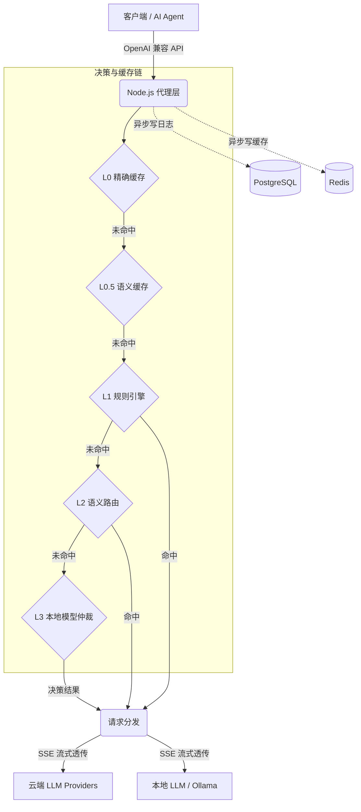

<div align="center">


# 🦞 Smart Router Butler

**一个接口，万模随心。你的本地 AI 智能路由管家。**

[](LICENSE)
[](https://github.com/Moonaria123/smart-router-butler/actions/workflows/ci.yml)
[](CODE_OF_CONDUCT.md)

[](https://www.typescriptlang.org/)
[](https://www.python.org/)
[](https://nextjs.org/)

[**快速开始**](#-快速开始自托管) · [**核心特性**](#-核心特性) · [**配置指南**](#%EF%B8%8F-配置说明摘要) · [**安全与隐私**](#%EF%B8%8F-安全与隐私)

[English](README.md) | [中文](README.zh-CN.md)

*Smart Router Butler 是一套 100% 本地运行、可自托管的 OpenAI 兼容 API 智能路由器。它在成本、延迟与质量之间自动权衡，让你只需对接一个端点，即可无缝调度云端大模型与本地小模型。*

</div>

---

## 💡 为什么需要 Smart Router Butler？

在 AI 代理和 IDE 辅助编程的日常使用中，我们经常遇到这些痛点：

- 💸 **高昂的 API 成本**：无论是简单的拼写检查还是复杂的架构设计，工具往往默认调用最贵的大模型（如 GPT-4o 或 Claude 3.5 Sonnet）。
- 🧱 **死板的全局配置**：无法根据任务类型（代码补全、长文总结、多步推理）灵活分配最合适的模型。
- 📦 **黑盒与脆弱性**：路由逻辑不透明，单一模型服务不可用时，整个代理工作流直接崩溃。

**Smart Router Butler** 将「选哪个模型」变成了一个**可策略化、可热更新**的配置问题。它作为你的本地代理层，接管所有 LLM 请求，并根据你设定的规则和语义智能分发。

---

## ✨ 核心特性

- 🧠 **多层智能路由**：首创 L1（规则） + L2（语义） + L3（本地模型仲裁）三层决策链，精准匹配任务与模型。
- 💰 **显著降低成本**：将简单任务卸载给本地模型或廉价 API，复杂任务保留给旗舰模型。
- 🛡️ **高可用与自动降级**：内置熔断器与 Fallback 机制，主模型超时或报错时自动切换备用模型，保障业务不中断。
- 📊 **全链路可观测**：提供精美的 Next.js Web 控制台，请求日志、Token 消耗、命中规则一目了然。
- 🔒 **100% 数据掌控**：完全自托管，数据不下车；API Key 采用 AES-256-GCM 加密存储，拒绝第三方网关的隐私风险。
- ⚡ **极致性能**：L1 规则引擎内存同步匹配（<2ms），全程支持 SSE 流式透传，无感接入。

---

## 🏗️ 架构与路由决策链



> **L3 仲裁** 依赖宿主机运行的 Ollama 小模型（如 `fauxpaslife/arch-router:1.5b`），在规则和语义都无法覆盖时，由 AI 动态判断最佳去向；超时或不可用时自动降级。

---

## 📸 界面预览

<div align="center">

| 路由规则管理 | 自然语言生成规则 |
|:---:|:---:|
|  |  |

| 规则命中分析 | 规则编辑器 |
|:---:|:---:|
|  |  |

| AI 规则向导 | 请求日志 |
|:---:|:---:|
|  |  |

| Raw JSON 编辑器 |
|:---:|
|  |

</div>

---

## 🚀 快速开始（自托管）

### 前置条件

| 依赖 | 说明 |
|------|------|
| **Docker & Compose** | 用于一键编排 `proxy` / `router` / `dashboard` / `postgres` / `redis` |
| **Ollama**（可选） | 用于 L3 本地模型仲裁；容器内通过 `host.docker.internal:11434` 访问宿主机 |

**源码获取**：当前**仅通过 GitHub** 分发（`git clone`、**Code → Download ZIP** 或 **Releases** 资产）。**不提供** `npm install <包名>` 安装本系统；npm 仅用于克隆后在 `proxy/`、`dashboard/` 内安装**第三方依赖**。

### 3 分钟部署步骤

1. **克隆**

   ```bash
   git clone https://github.com/Moonaria123/smart-router-butler.git
   cd smart-router-butler
   ```

2. **环境变量**

   ```bash
   cp .env.example .env
   # 编辑：DATABASE_URL、REDIS_URL、ENCRYPTION_KEY、BETTER_AUTH_SECRET 等
   ```

3. **（可选）L3 模型**

   ```bash
   ollama pull fauxpaslife/arch-router:1.5b
   ```

4. **启动**

   ```bash
   docker compose up -d
   docker compose exec dashboard npx prisma migrate deploy
   ```

5. **访问**：控制台 `http://localhost:3000`；客户端指向 Proxy 的 OpenAI 兼容地址 `http://localhost:8080/v1`。

详见 `docker-compose.yml`、`docker-compose.release.yml` 与子目录 README。

### 本地开发时的 npm 依赖

在 `proxy/`、`dashboard/` 执行 `npm ci` 时，`.npmrc` 仅影响**依赖包**下载源，**不能**替代 `git clone`。Dockerfile 会复制 `.npmrc`；Router 使用 `pip install -r requirements.txt`。

---

## ⚙️ 配置说明（摘要）

| 类别 | 入口 |
|------|------|
| 全局与端口 | `.env.example`、`compose/ports.env` |
| 代理 / 路由 | `PYTHON_ROUTER_URL`、`OLLAMA_URL`、`ARCH_ROUTER_MODEL`、`ROUTING_ENABLE_L2` / `L3` 等 |
| 控制台与认证 | `BETTER_AUTH_URL`、`BETTER_AUTH_SECRET`、`DATABASE_URL`、`PROXY_URL` |
| 预构建镜像 | `GHCR_OWNER`、`SMARTROUTER_IMAGE_TAG` |

**切勿**将 `.env`、API Key 或生产连接串提交到 Git。

---

## 与其它方案的差异

| 维度 | 典型云端聚合网关 | Smart Router Butler |
|------|------------------|---------------------|
| **数据隐私** | 流量经第三方中转，存在泄露风险 | **100% 自托管**，数据不下车，路径完全由你控制 |
| **路由逻辑** | 平台黑盒，无法干预 | **L1/L2/L3 白盒化**，规则透明、可配置、可解释 |
| **合规性** | 依赖供应商条款，受限于地域 | **可部署在自有网络**，满足最严格的企业合规要求 |
| **成本控制** | 平台抽成或固定月费 | **零平台费**，按需路由最大化榨干免费/廉价模型价值 |

---

## 📂 仓库结构（节选）

| 目录 | 说明 |
|------|------|
| `proxy/` | Node.js 代理：OpenAI 兼容 API、L0/L1、SSE |
| `router/` | FastAPI：语义路由、缓存、L3 相关 |
| `dashboard/` | Next.js：规则、Provider、日志 |
| `contracts/` | 服务间契约 |

---

## 🛠️ 开发与健康检查（维护者）

```bash
# proxy/
npm run type-check && npm run lint

# router/
python -m mypy app/ --strict && python -m ruff check app/

# dashboard/
npm run type-check && npm run lint
```

---

## ⚖️ 开源治理与合规

| 文档 | 说明 |
|------|------|
| [**LICENSE**](LICENSE) | **MIT** 授权 |
| [**CODE_OF_CONDUCT.md**](CODE_OF_CONDUCT.md) | 基于 **Contributor Covenant 2.1** 的社区行为准则 |
| [**CONTRIBUTING.md**](CONTRIBUTING.md) | 贡献流程、知识产权与代码规范 |
| [**SECURITY.md**](SECURITY.md) | 漏洞报告与负责任披露 |

参与 Issue、PR、讨论前请阅读 **行为准则**。维护者保留对破坏性、骚扰性内容采取管理措施的权利。

---

## 🛡️ 安全与隐私

- **漏洞报告**：请勿在公开区披露可利用细节；请遵循 [**SECURITY.md**](SECURITY.md)。  
- **部署与数据**：本软件**自托管**运行；用户提示词、响应、日志与密钥**由部署者**在自有基础设施上管理；**请自行**审阅与上游 LLM 提供商的服务条款及数据驻留政策。  
- **供应链**：建议在生产使用锁定版本的镜像与依赖（`package-lock.json`、`requirements.txt`），并关注依赖安全公告。  

---

## 🤝 贡献

欢迎 Issue 与 Pull Request，详见 [**CONTRIBUTING.md**](CONTRIBUTING.md)。贡献即表示你同意 [**CODE_OF_CONDUCT.md**](CODE_OF_CONDUCT.md) 与 [**LICENSE**](LICENSE) 下的许可安排。

---

## 📜 许可证与免责声明

- 软件在 [**MIT License**](LICENSE) 下发布。  
- **按原样提供（AS IS）**：不作适销性、特定用途适用性、非侵权等明示或默示担保；**使用本软件的风险由使用者自行承担**。  
- **间接损害**：在法律允许范围内，作者与贡献者不对任何间接、偶然、特殊或后果性损害承担责任。  

---

## 📚 相关阅读

- 智能路由与成本优化可参考业界同类讨论；本仓库不保证与第三方产品功能一一对应。
